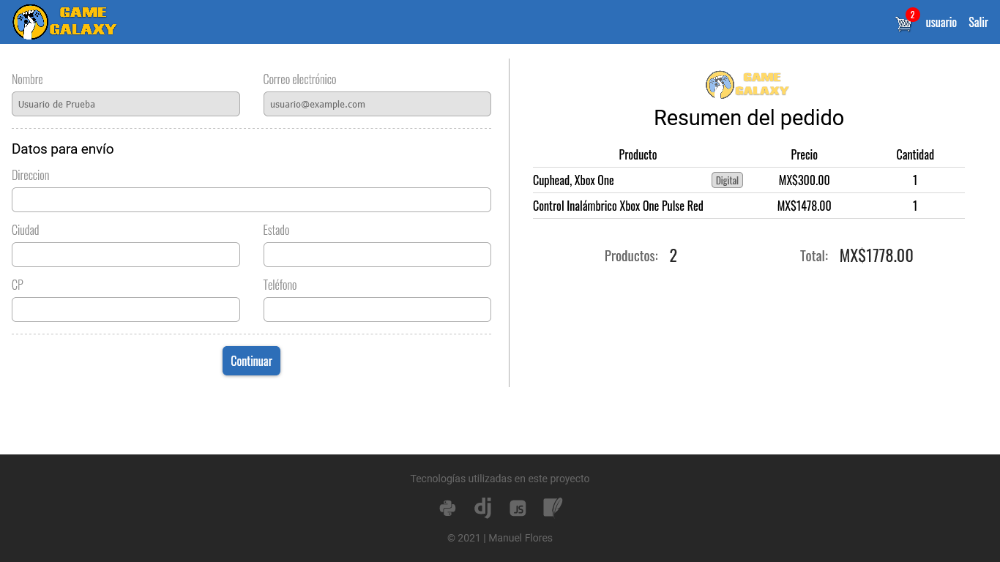

# E-Commerce App con Python(Django)

Proyecto realizado con [Django](https://www.djangoproject.com/)

Ejemplo de una tienda online, el usuario debe estar registrado para agregar productos al carrito y proceder al pago (simulado)

## Imágenes

> #### Vista de administrador
>
> El administrador tiene el control total de la creación de productos así como de los usuarios y las órdenes (pedidos)


> #### Vista principal de la aplicación


> #### Registro de usuario


> #### Vista principal de la aplicación con un usuario 'logueado'
>
> Se muestra el botón del carrito, así como también los botones de cada producto para agregarlos al mismo


> #### Vista de carrito


> #### Vista del resumen de los productos
>
> Si el producto es solo digital, se muestra el botón continuar


> Si el producto es físico, se muestra un formulario para obtener la dirección



## Uso

```bash
python manage.py runserver
```
